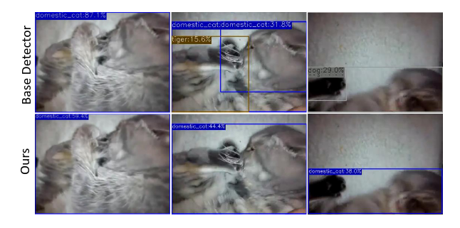
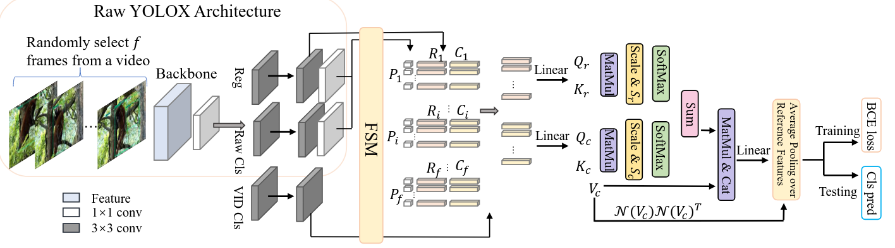
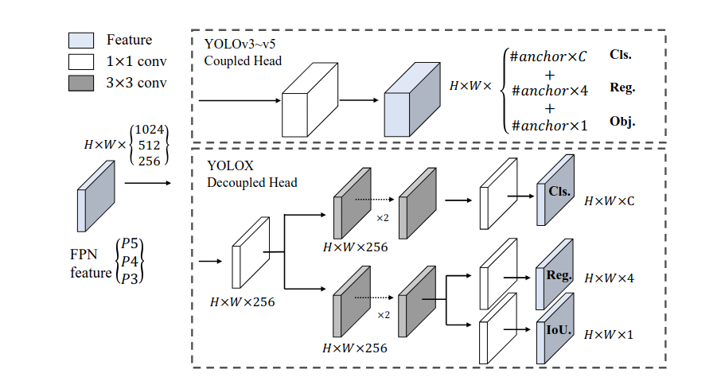
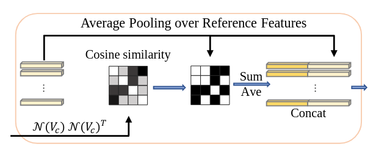
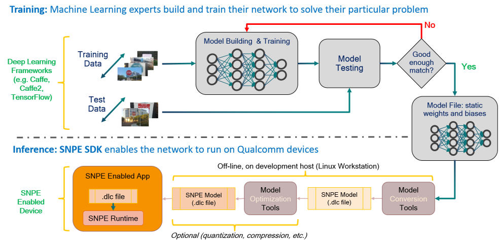
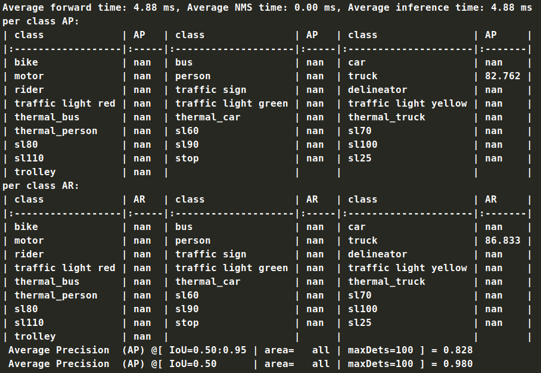

# Report

## Background

​	相比于图片格式，视频格式数据具有更加丰富的上下文信息，从而帮助模型在当前帧检测。但是，视频中部分帧由于动作太快，进而导致这一部分会比较模糊（留下残影）。在使用传统的图片检测模型在视频格式预测，则会将这些模糊的帧上面的残影识别成相似物体，甚至会对原本的物体预测产生影响，如图：



因此需要对视频格式数据采取针对性的训练策略，进而规避模糊帧的干扰，充分利用上下文的信息加强预测效果。而**如何聚合不同帧的信息**成为了视频检测中最重要的问题。

​	在以往的视频检测中，通常使用的是二阶段 （Two-stage）检测策略，即先检测特征中出现物体的可能区域 （Region Proposals， RPs），然后对当前帧某个可能区域内的图像进行预测。而在预测时会检索前后帧相同区域的特征，并对这些特征做聚合，最终做出分类。显然，这种办法会带来高昂的计算，因为第一阶段的 RPs 非常多，然后对某一帧的某一可能区域进行检测时需要完成上述操作（检索、聚合、分类）。

​	聚合操作的策略主要有两类：1）基于框（box-level）和 2）基于特征（feature-level）。基于框的聚合适用于一阶段（One-stage）和二阶段检测策略，这种策略是通过将不同帧的同一目标（位置、类别）的检测框关联起来，形成一个筒（Tubelet）进而优化检测结果。例如通过交并比（IoU）匹配不同帧的目标，IoU超过0.5的目标之间可以进行关联。通过这种**框关联策略**来过滤掉难以形成一条筒目标，进而减少残影误检的问题，同时也带来了对于突然出现物体的漏检的风险。

​	对于基于特征的聚合策略是直接对齐和融合不同帧的同一特征。这种处理方法主要适用于二阶段检测方法，因为在二阶段检测中的第一阶段是通过固定大小框选择固定大小的特征，特征的位置和大小更加准确；而对于一阶段检测策略，由于初步给出的预测框非常多，特征聚合的目标难以确定，计算也会非常繁琐复杂。如何在一阶段检测策略实时推理优势上结合基于特征的高效聚合策略则是 YOLOV 解决的问题。

​	基于此，YOLOV 使用了取巧的办法：在对所选的帧进行一阶段策略初步预测出预测框（Bbox）和置信度得分（Conference Scores)， 然后通过置信度得分阈值和非极大值抑制（Non-Maximum Suppression，NMS）对初步结果进行筛选，最后执行聚合与分类。通过这种办法，YOLOV极大地加快了视频检测的推理时间，同时解决了图片检测器在视频数据上检测异常的问题。

## YOLOV  Model

### 架构



​	一图胜千言，能够看出 YOLOV 采用 YOLOX 作为基础架构，并制定特征后处理策略：是通过在视频中随机选取若干帧图片（实际上在源项目中，作者尝试过多种选帧方法），然后经过特征选取模块（Feature Selection Module ，FSM）选取出top K的候选区域，然后经过后面的特征聚合模块（Feature Aggregation Module ，FAM）融合不同帧信息，最终完成预测。

#### **特征选取模块：**

​	在这一部分，我们需要先了解一下YOLOX的架构，这对于本部分特征操作的理解比较重要。YOLOX的head是通过将预测框位置的回归预测与框中物体的分类预测解耦，使用两个分支执行两个任务，原文中的解释是回归与分类两种任务冲突（回归要求细化几何特征，分类要求宏观语义特征），共享同一个head收敛速度会下降。


​	原文作者在实验中发现，如果直接将一阶段的特征送进分类分支会带来训练不问题（随机初始化的特征聚合模块与具有预训练权重的Backbone部分初始时刻难以兼容），同时也会使Backbone在原来静态检测的性能下降，从而影响后续特征。因此作者使用一个新的分支，定义为**视频分类分支**，用于生成特征指导后续不同帧信息的聚合。

​	在Backbone提取特征之后，分别送进三个分支，同时对特征进行筛选：根据置信度分数选择前750个proposals，然后选择超过NMS阈值的特征。然后对收集到的这些特征在源项目中的yolovp_msa.py中的find_feature_score方法中进一步处理：数据形状对其以及每一帧选择self.simN个特征，这一参数可以在yolov_base.py中的self.default_p进行更改。在进过特征选取最终的特征变成三列，分别代表置信度得分、目标框特征和分类特征。
```python
    def postpro_woclass(self, prediction, num_classes, nms_thre=0.75, topK=75, ota_idxs=None):
        # find topK predictions, play the same role as RPN
        '''

        Args:
            prediction: [batch,feature_num,5+clsnum]
            num_classes:
            conf_thre:
            conf_thre_high:
            nms_thre:

        Returns:
            [batch,topK,5+clsnum]
        '''
        self.topK = topK
        box_corner = prediction.new(prediction.shape)
        box_corner[:, :, 0] = prediction[:, :, 0] - prediction[:, :, 2] / 2
        box_corner[:, :, 1] = prediction[:, :, 1] - prediction[:, :, 3] / 2
        box_corner[:, :, 2] = prediction[:, :, 0] + prediction[:, :, 2] / 2
        box_corner[:, :, 3] = prediction[:, :, 1] + prediction[:, :, 3] / 2
        prediction[:, :, :4] = box_corner[:, :, :4]

        output = [None for _ in range(len(prediction))]
        output_index = [None for _ in range(len(prediction))]

        for i, image_pred in enumerate(prediction):
            #take ota idxs as output in training mode
            if ota_idxs is not None and len(ota_idxs[i]) > 0:
                ota_idx = ota_idxs[i]
                topk_idx = torch.stack(ota_idx).type_as(image_pred)
                output[i] = image_pred[topk_idx, :]
                output_index[i] = topk_idx
                continue

            if not image_pred.size(0):
                continue
            # Get score and class with highest confidence
            class_conf, class_pred = torch.max(image_pred[:, 5: 5 + num_classes], 1, keepdim=True)

            # Detections ordered as (x1, y1, x2, y2, obj_conf, class_conf, class_pred)
            detections = torch.cat(
                (image_pred[:, :5], class_conf, class_pred.float(), image_pred[:, 5: 5 + num_classes]), 1)

            conf_score = image_pred[:, 4]
            top_pre = torch.topk(conf_score, k=self.Prenum)
            sort_idx = top_pre.indices[:self.Prenum]
            detections_temp = detections[sort_idx, :]
            nms_out_index = torchvision.ops.batched_nms(
                detections_temp[:, :4],
                detections_temp[:, 4] * detections_temp[:, 5],
                detections_temp[:, 6],
                nms_thre,
            )

            topk_idx = sort_idx[nms_out_index[:self.topK]]
            output[i] = detections[topk_idx, :]
            output_index[i] = topk_idx

        return output, output_index
```

#### 特征聚合模块

​	这一部分是对参考帧中相同目标的特征进行聚合，进而指导当前帧的预测。这部分重点需要考虑的问题是怎么选取相同目标在参考帧中的特征呢？传统的基于余弦相似度的特征选取会导致**同质化问题**（homogeneity issue），例如当目标帧的某一目标是模糊的，引入的参考帧目标也会很模糊。值得注意的是，计算proposal的相似度是对所有帧的所有proposal完成的。
​	我们来看一下作者在原文中举出的例子，使用传统的cosine相似度计算、自注意力和作者提出来的加权自注意力机制计算挑选出的相似proposal：


​	作者引入了**加权的多头自注意力机制**来解决这个问题，加权是指上一阶段得到的置信度和IoU得分。在之前的特征选取中，通过筛选之后的特征shape变成[f*a, d],即[抽取帧数\*每一帧的特征， 用于预测的维度（特征flatten）]，这里再计算就会方便很多。另外需要注意的是作者对class feature和reg feature使用了同一个$V_c$

这里我们对分类特征做一次计算加深理解，

$Q_c = W_q(Class feature), K_c = W_k(Class feature),V_c = W_v(Class feature)$

$A_c = Q_cK^T_c/\sqrt{d}$

$SelfAttention = softmax(A_c)*V_c$

在上述自注意力机制的基础上，作者通过**引入置信度得分**[f*a, 1]重复f\*a次变成矩阵$S_c \in R^{fa\times fa}$参与计算：

$SelfAttention\_update = softmax(S_c◦ A_c)*V_c$

经过这种置信度参与计算的操作，模型会更加关注高置信度的特征，而不仅仅是相似的。

​	更近一步，作者对目标分类和预测框回归的两种加权自注意力表征特征做了**池化操作**，实现目标分类与位置的信息补充。将自注意机制下的表征与$V_c$矩阵拼接在一起，最终使用线性分类器完成预测。

$SelfAttention\_feature = concat[(SA_c + SA_r)/2 ,V_c]$

这样做的好处：举个例子，当前帧有一辆汽车，假如参考帧现在有三个候选位置：

- 框A：同一汽车（cls_score=0.9, IoU=0.8），具有高语义相似度 + 高位置得分，最终权重0.6

- 框B：不同汽车（cls_score=0.7, IoU=0.3），语义相似但位置不匹配，最终权重0.1（被sim_mask抑制）

- 框C：背景（cls_score=0.2, IoU=0.1），低置信度，最终 权重0（被cls_score过滤）

​	最后，为了避免自注意力机制中softmax计算权重中，小部分特征占据大多数的权重，从而忽略了参考帧中的部分可能特征，作者再次进行了**平均池化**的方法：

- 首先计算Vc的相似度，这里就是点乘。然后根据threshold生成0，1mask，去相关度较低的proposals
  $Norm(V_c) \cdot Norm(V_c^T)$

- 然后对softmax的概率probs重新归一化，保留更加丰富参考proposals
  $p' = sim\_mask \cdot p/sum(sim\_mask \cdot p, -1)$

  > sim_round2 = sim_mask * sim_round2 / (torch.sum(sim_mask * sim_round2, dim=-1, keepdim=True))

- 最后刚刚重新归一化概率矩阵重新乘以$SelfAttention\_feature $，并且再次完成一次拼接$SelfAttention\_feature $，既保留softmax概率下峰化的结果，又保留重归一化下多样性的结果。




源代码如下：

```python
class Attention_msa(nn.Module):
    def __init__(self, dim, num_heads=8, qkv_bias=False, attn_drop=0., scale=25):
        # dim :input[batchsize,sequence length, input dimension]-->output[batchsize, sequence lenght, dim]
        # qkv_bias : Is it matter?
        # qk_scale, attn_drop,proj_drop will not be used
        # object = Attention(dim,num head)
        super().__init__()
        self.num_heads = num_heads
        head_dim = dim // num_heads
        # NOTE scale factor was wrong in my original version, can set manually to be compat with prev weights
        self.scale = scale  # qk_scale or head_dim ** -0.5

        self.qkv_cls = nn.Linear(dim, dim * 3, bias=qkv_bias)
        self.qkv_reg = nn.Linear(dim, dim * 3, bias=qkv_bias)

        self.attn_drop = nn.Dropout(attn_drop)

    def forward(self, x_cls, x_reg, cls_score=None, fg_score=None,
                return_attention=False, ave=True, sim_thresh=0.75,
                use_mask=False,**kwargs):
        B, N, C = x_cls.shape

        qkv_cls = self.qkv_cls(x_cls).reshape(B, N, 3, self.num_heads, C // self.num_heads).permute(2, 0, 3, 1, 4)
        qkv_reg = self.qkv_reg(x_reg).reshape(B, N, 3, self.num_heads, C // self.num_heads).permute(2, 0, 3, 1, 4)
        q_cls, k_cls, v_cls = qkv_cls[0], qkv_cls[1], qkv_cls[2]  # make torchscript happy (cannot use tensor as tuple)
        q_reg, k_reg, v_reg = qkv_reg[0], qkv_reg[1], qkv_reg[2]

        q_cls = q_cls / torch.norm(q_cls, dim=-1, keepdim=True)
        k_cls = k_cls / torch.norm(k_cls, dim=-1, keepdim=True)
        q_reg = q_reg / torch.norm(q_reg, dim=-1, keepdim=True)
        k_reg = k_reg / torch.norm(k_reg, dim=-1, keepdim=True)
        v_cls_normed = v_cls / torch.norm(v_cls, dim=-1, keepdim=True)
        v_reg_normed = v_reg / torch.norm(v_reg, dim=-1, keepdim=True)

        if cls_score == None:
            cls_score = 1
        else:
            cls_score = torch.reshape(cls_score, [1, 1, 1, -1]).repeat(1, self.num_heads, N, 1)

        if fg_score == None:
            fg_score = 1
        else:
            fg_score = torch.reshape(fg_score, [1, 1, 1, -1]).repeat(1, self.num_heads, N, 1)
		# 计算相似度
        attn_cls_raw = v_cls_normed @ v_cls_normed.transpose(-2, -1)
        attn_reg_raw = v_reg_normed @ v_reg_normed.transpose(-2, -1)

        if use_mask:
            # only reference object with higher confidence..
            cls_score_mask = (cls_score > (cls_score.transpose(-2, -1) - 0.1)).type_as(cls_score)
            fg_score_mask = (fg_score > (fg_score.transpose(-2, -1) - 0.1)).type_as(fg_score)
        else:
            cls_score_mask = fg_score_mask = 1


        # cls_score_mask = (cls_score < (cls_score.transpose(-2, -1) + 0.1)).type_as(cls_score)
        # fg_score_mask = (fg_score < (fg_score.transpose(-2, -1) + 0.1)).type_as(fg_score)
        # visual_attention(cls_score[0, 0, :, :])
        # visual_attention(cls_score_mask[0,0,:,:])

        attn_cls = (q_cls @ k_cls.transpose(-2, -1)) * self.scale * cls_score * cls_score_mask
        #remove ave and conf guide in the reg branch, modified in 2023.12.5
        attn_reg = (q_reg @ k_reg.transpose(-2, -1)) * self.scale# * fg_score * fg_score_mask

        if kwargs.get('local_mask', False):
            lframe,gframe,P = kwargs.get('lframe'),kwargs.get('gframe'),kwargs.get('afternum')
            local_mask_branch = kwargs.get('local_mask_branch')
            if 'cls' in local_mask_branch:
                attn_cls[:, :, 0:lframe * P, 0:lframe * P] = -1e4
            if 'reg' in local_mask_branch:
                attn_reg[:, :, 0:lframe * P, 0:lframe * P] = -1e4

        attn_cls = attn_cls.softmax(dim=-1)
        attn_cls = self.attn_drop(attn_cls)

        attn_reg = attn_reg.softmax(dim=-1)
        attn_reg = self.attn_drop(attn_reg)

        attn = (attn_reg + attn_cls) / 2
        x = (attn @ v_cls).transpose(1, 2).reshape(B, N, C)
        x_ori = v_cls.permute(0, 2, 1, 3).reshape(B, N, C)
        x_cls = torch.cat([x, x_ori], dim=-1)
        #
        x_reg = (attn @ v_reg).transpose(1, 2).reshape(B, N, C)
        x_ori_reg = v_reg.permute(0, 2, 1, 3).reshape(B, N, C)
        x_reg = torch.cat([x_reg, x_ori_reg], dim=-1)

        if ave:
            conf_sim_thresh = kwargs.get('conf_sim_thresh', 0.99)
            ones_matrix = torch.ones(attn.shape[2:]).to(x.device)
            zero_matrix = torch.zeros(attn.shape[2:]).to(x.device)
			
            # 对每一个头的结果做平均
            attn_cls_raw = torch.sum(attn_cls_raw, dim=1, keepdim=False)[0] / self.num_heads
            attn_reg_raw = torch.sum(attn_reg_raw, dim=1, keepdim=False)[0] / self.num_heads
            sim_mask = torch.where(attn_cls_raw > sim_thresh, ones_matrix, zero_matrix)
            #remove ave and conf guide in the reg branch, modified in 2023.12.5
            obj_mask = torch.where(attn_reg_raw > conf_sim_thresh, ones_matrix, zero_matrix)
            # 通过sim_mask过滤掉相似度较低的特征
            if use_mask:
                # 然后对满足条件的特征，将置信度的分与IoU 结果考虑进来
                sim_mask = sim_mask*cls_score_mask[0,0,:,:]*fg_score_mask[0,0,:,:]
            sim_attn = torch.sum(attn, dim=1, keepdim=False)[0] / self.num_heads

            sim_round2 = torch.softmax(sim_attn, dim=-1)
            # 下面其实是做了一个掩码，过滤不相关特征；
            # 并且对结果做了归一化，相当于重新计算了softmax出来的概率，保留了多样性特征
            sim_round2 = sim_mask * sim_round2 / (torch.sum(sim_mask * sim_round2, dim=-1, keepdim=True))
            obj_mask = obj_mask * sim_round2 / (torch.sum(obj_mask * sim_round2, dim=-1, keepdim=True))
            return x_cls, x_reg, sim_round2, obj_mask
        else:
            return x_cls, x_reg, None, None
```

#### 在线视频推理

在训练推理的时候，为了加快计算速度使用Attention_msa_online类，去掉了回归分支的mask计算，同时去掉分类分支的重归一化概率，既减少最后特征的维度，又能加快计算。
TODO：

- [ ] 将类似于KV cache的思路拿到这里用于加快计算，尤其是视频实时推理


#### YOLOV 工作流程


工作流程：



#### YOLOV Features post processing


- Video Branch
  用于指导特征聚合的权重

- 特征聚合
  相似度计算，然后用相似的帧辅助预测。余弦相似度会带来同质化的问题，如果关键帧本身很模糊，效果就会很差。
  
  - Affinity matrix
  - Cosine Similarity
  
  
  
  在计算相似度之后，把超出阈值的特征进行池化。
  
  

## YOLOV Training

## 训练全流程

### 源代码与环境


### 数据

#### 格式转换

​	YOLOV训练采用的数据格式是OVIS，所以需要将标注（Annotations）整理成 .xml文件格式。在数据的保存上面这里的要求比较严格，也是原作者的项目里面issue最多的问题：

- 图片需要以视频为单位文件夹进行保存，同时最好对每一个视频的帧统一，之后训练的 batchsize 就是我们这里固定的帧数。因为YOLOV的训练使用一个视频中的帧进行训练，这些帧作为一个batch送进训练。

- Annotations和Data的存放需要严格对仗，这是由于作者在yolox/data/datasets/vid.py获取数据并保存路径的函数get_annotation中，做了相应设置：

  > ```python
  > path = path.replace("Data","Annotations").replace("JPEG","xml")
  > ```

- 图片文件后缀 .JPEG如果更改，需要在上述代码进行更改，原因同上。

#### xml文件

.xml文件格式如下，<trackid>1</trackid>就是物体分类编号，具体转换代码可以参考tools/tfrecord_to_voc.py ：

```python
<annotation>
<folder>./dataset/VIA/tf_record/20241206-aws.tfrecord</folder>
<filename>image000503.JPEG</filename>
<source>
<database>Hess_20241206</database>
</source>
<size>
<width>1280</width>
<height>720</height>
</size>
<object>
<trackid>1</trackid>
<name>truck</name>
<bndbox>
<xmax>453</xmax>
<xmin>36</xmin>
<ymax>557</ymax>
<ymin>34</ymin>
</bndbox>
<occluded>0</occluded>
<generated>0</generated>
</object>
</annotation>
```

而数据存放格式：

```
./dataset/
├── train/
│   ├── Annotations/
│	│	└── video000001
│	│		└── image000001.xml
│   └── Data/
│       └── video000001
│       	└── image000001.JPEG
└── val/
```

#### VID Dataset

​	为了使用作者已经做好的VID dataset类，这里需要将本地数据的分类的字典在yolox/data/datasets/vid.py写明，这样之前的.xml标注文件中的物体分类编号才能对应。
```python
via_classes = ["bike",···]
numlist = range(25)
name_num = dict(zip(via_classes,numlist))
```

​	在完成上述操作之后，需要获取数据路径，并且保存成numpy文件进行后续训练, 代码可以参考tools/pipeline.py中的：

> ```python
> vid.make_path(data_dir+'ovis_format/train/',data_dir+'ovis_format/train_seq.npy')
> vid.make_path(data_dir+'ovis_format/val/',data_dir+'ovis_format/val_seq.npy')
> ```


### 训练

​	作者通过一个超参数width和heigth来限制模型的参数量，进而区分YOLOV_s,\_m,\_l等不同大小的模型。在进行训练参数的设置时，我们可以在exps/yolov/yolov_base.py中的父类 Exp 中更改，而yolov其他大小的模型都是继承这一父类，更改的参数也只有width和heigth。

需要进行统一的参数有：
```python
self.num_classes = 25 # detect classes number of model
self.input_size = (288, 512)  # (height, width)
self.data_dir = ''  
self.vid_train_path = './dataset/VIA/ovis_format/train_seq.npy'
self.vid_val_path = './dataset/VIA/ovis_format/val_seq.npy'
self.test_size = (288, 512)
```

​	在作者的论文还有项目中均有提到，推荐的训练方式是先用backbone在静态图片数据训练使之能够提取出图片优质的feature，然后再接上聚合模块训练视频检测能力，相当于是两阶段的训练。然而在自己的测试中，直接使用整个模型对数据集进行微调可以取得更快更好的检测效果。

​	最后是训练模型的一些推荐：

- self.fix_bn = False 开放backbone权重微调

-  self.gmode = True # 为了判断当前帧，从视频中其他帧进行抽取
   self.lmode = False #  为了判断当前帧，从当前帧附近其他帧进行抽取 self.both_mode = False
   self.lframe = 8
  self.gframe = 120

   这里的g_frame和l_frame相加需要等于batchsize

- self.defualt_p = 30 是一帧图片的可能目标，如果应用场景中物体稀疏，可以适当减小，反之增加

  开始训练

```shell
python tools/vid_train.py -n yolov-s -c YOLOX_outputs/yolox_s/best_ckpt.pth -f exps/yolov/yolov_s.py -b 4
```

​	推理验证(视频)
```shell
python tools/vid_demo.py --path /media/hazelwang/FE92D56C92D529C3/yolov/YOLOV/dataset/VIA/ovis_format/val/Data/video000001/output.mp4 -c YOLOX_outputs/yolov_s/best_ckpt.pth -f exps/yolov/yolov_s.py --conf 0.25 --nms 0.5
```


### onnx与推理

作者未提供onnx模型导出与onnx_inference，我参考了yolox的代码并且结合yolov的后处理进行补充, 参见demo/VIA/yolov_via/export_onnx.py与onnx_inference.py

```shell
python demo/VIA/yolox_via/export_onnx.py -f exps/default/yolox_s.py -c YOLOX_outputs/yolox_s/best_ckpt.pth -n yolox-s --output-name demo/VIA/yolox_via/yolox_s.onnx

```

onnx inference 

```python
python demo/VIA/yolox_via/onnx_inference.py -m demo/VIA/yolox_via/yolox_s.onnx -i /media/hazelwang/FE92D56C92D529C3/yolov/YOLOV/dataset/VIA/coco_format/val/Data/video000008/image000868.JPEG -o demo/VIA/yolox_via/test.JPEG -s 0.3 --input_shape 288,512
```

### 部署与量化

#### 高通量化简介

这里的测试是在高通芯片上面完成的，可见高通DLC的转换流程。SNPE（Snapdragon Neural Processing Engine）提供模型权重的转换（转dlc）与优化（量化、压缩），进而可以部署到移动端设备上。
DLC是深度学习容器，是高通芯片特定的中间表示形式


#### 注意事项

我所使用的高通SDK并不支持一些算子，例如yolox一开始将width和hidth转化到channel，具体见yolox/models/darknet.py中的focus，这种slice操作在SNPE1.4.1无法使用，所以挪到dataset完成。
```python
# stem
# self.stem = Focus(3, base_channels, ksize=3, act=act)

class Focus(nn.Module):
    """Focus width and height information into channel space."""

    def __init__(self, in_channels, out_channels, ksize=1, stride=1, act="silu"):
        super().__init__()
        self.conv = BaseConv(in_channels * 4, out_channels, ksize, stride, act=act)

    def forward(self, x):
        # shape of x (b,c,w,h) -> y(b,4c,w/2,h/2)
        # print(x.shape)
        # patch_top_left = x[..., ::2, ::2]
        # patch_top_right = x[..., ::2, 1::2]
        # patch_bot_left = x[..., 1::2, ::2]
        # patch_bot_right = x[..., 1::2, 1::2]
        # x = torch.cat(
        #     (
        #         patch_top_left,
        #         patch_bot_left,
        #         patch_top_right,
        #         patch_bot_right,
        #     ),
        #     dim=1,
        # )
        return self.conv(x)
```

然后是PAN结构中需要对齐height，width，这里的上采样插值操作可以使用固定权重的CNN2D卷积核替代
```python
# self.upsample = nn.Upsample(scale_factor=2, mode="nearest")

# 替换 nn.Upsample
class FixedNearestDeconv(nn.Module):
    def __init__(self, channels, scale=2):
        super().__init__()
        self.deconv = nn.ConvTranspose2d(
            in_channels=channels,
            out_channels=channels,
            kernel_size=scale,
            stride=scale,
            padding=0,
            groups=channels,
            bias=False
        )
        with torch.no_grad():
            # 每个通道一个单位卷积
            self.deconv.weight.zero_()
            for i in range(channels):
                self.deconv.weight[i, 0, :, :] = 1.0

        self.deconv.weight.requires_grad_(False)

    def forward(self, x):
        return self.deconv(x)
self.upsample0 = FixedNearestDeconv(channels=int(in_channels[1] * width), scale=2)
self.upsample1 = FixedNearestDeconv(channels=int(in_channels[0] * width), scale=2)
```


#### **环境搭建**

1. 下载SDK

   https://docs.qualcomm.com/bundle/publicresource/topics/80-70015-15BY/snpe-download.html
   在setup看环境配置
   在tools看运行流程

2. 配置环境
   以snpe 1.41.0版本为例，安装python 3.5环境，然后解压文件，下载和检验依赖环境
   

3. 导入onnx环境
   在snpe/bin/envsetup.sh中添加onnx安装包位置

   ```shell
   source bin/envsetup.sh -o /home/hazelwang/anaconda3/envs/snpe41_bk/lib/python3.5/site-packages/onnx
   ```

   得到结果

   ```shell
   [INFO] Setting ONNX_HOME=/home/hazelwang/anaconda3/envs/snpe/lib/python3.5/site-packages/onnx
   
   [INFO] Found ndk-build at  /home/hazelwang/Android/Sdk/ndk/20.0.5594570/ndk-build
   ```

4. onnx转dlc
   在每次开机或者显示"No module named 'qti'"的时候把onnx环境重新导入一下就可以了，然后执行命令
   可尝试只加--input_network 参数，来解决部分无法正常导出的问题

   ``` shell
   bin/x86_64-linux-clang/snpe-onnx-to-dlc --input_network /media/hazelwang/FE92D56C92D529C3/yolov/YOLOV/demo/VIA/yolov_s.onnx --output_path /media/hazelwang/FE92D56C92D529C3/yolov/YOLOV/demo/VIA/yolov_s.dlc --input_dim 'x' 1,3,288,512
   
   ```

5. dlc 量化
   对于PTQ量化，需要先生成一些用来量化激活值数据的路径list.

   - 需要转化为二进制文件
   - 需要txt文件一行一行书写文件绝对地址
   - 需要和训练时候的shape和标准化一致

   ```python
   out_dir = "./demo/VIA/SNPEImgs/"
   file_list = open("./demo/VIA/SNPEImgs/SNPEImgList.txt", 'w')
   # flist = open("SNPEImgList_512_288.txt", 'w')
   
   for img_path in img_list:
       img = cv2.imread(img_path)
       print(img.shape)
       img = cv2.resize(img, (512, 288)) #(width, height)
       print(img.shape)
   
       img = cv2.cvtColor(img, cv2.COLOR_BGR2RGB)
       img = np.float32(img)
       # img[:, :, 0] = ((img[:, :, 0] - 104.01362025) / 73.60276650)  # / 127.5 - 1.0
       # img[:, :, 1] = ((img[:, :, 1] - 114.03422265) / 69.89082075)  # / 127.5 - 1.0
       # img[:, :, 2] = ((img[:, :, 2] - 119.91659580) / 70.91507670)  # / 127.5 - 1.0
   
       img_name = img_path.split("/")[-1].replace(".JPEG", ".data")
       print(img_name)
   
       file_list.write(out_dir + img_name + "\n")
       f = open(out_dir + img_name, 'wb')
       f.write(img)
       f.close()
   
   file_list.close()
   ```

   ptq激活量化

   ```shell
   bin/x86_64-linux-clang/snpe-dlc-quantize --input_dlc /media/hazelwang/FE92D56C92D529C3/yolov/YOLOV/demo/VIA/yolox_via/yolox_s.dlc --input_list /media/hazelwang/FE92D56C92D529C3/yolov/YOLOV/demo/VIA/SNPEImgs/SNPEImgList.txt --output_dlc /media/hazelwang/FE92D56C92D529C3/yolov/YOLOV/demo/VIA/yolox_via/yolox_s_quant.dlc --use_adjusted_weights_quantizer
   
   ```

6. DLC可视化

   ```python
   bin/x86_64-linux-clang/snpe-dlc-viewer -i <path/to/dlc/file>
   ```

   

## 训练参数

### 选帧

相比于选取所有帧，只是随机抽样1/10的图片训练（信息冗余）,原文最后变成16 帧。
**参考帧的采样策略[^可调参数]**对于最终的预测效果是很显著的：

- global sampling
  从视频里面选特定帧数：在31时效果最好
- local sampling
  在关键帧附近的连续抽取几张，**效果不如global sampling**（信息冗余和退化）

### 超参数

YOLOX_s 实验参数：

- Strong Augment; 
- Model params

YOLOV_s 参数：

- gframe + lframe, gframe mode;  
- proposal number / frame; Top K proposal; 
- Model params;
- NMS threshold; 
- similarity threshold
- Aggregation threshold

### 结果

统一参数：
size(288, 512), bs=4, 10 epochs ，其他沿用默认设置

数据：
20241206-aws.tfrecord, 0.8/0.1/0.1, 10729/1341/1342

**训练结果对比：**
能够看到yolov的检测结果要好很多，同时直接对整个模型进行微调而不是先训练backbone再训练聚合部分会好一些

| Model   | w/o Yolox | params | Gflops | inference | AP    |
| ------- | --------- | ------ | ------ | --------- | ----- |
| Yolox_s | False     | 8.95M  | 9.65   | 3.26 ms   | 16.62 |
| Yolov_s | False     | 9.83M  | 11.44  | 4.88 ms   | 82.80 |
| yolov_s | True      | 9.83M  | 11.44  | 3.53 ms   | 87.70 |



视频对比：
	附件

结论：

- 直接用YOLOV微调即可，不用使用论文中的二阶段训练（YOLOX+YOLOV 特征聚合）
- YOLOV在VIA数据上展示除了优异的应用前景